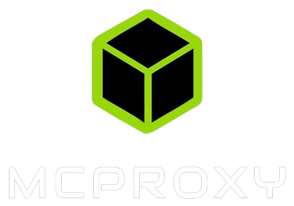

<p align="center">
    
    <b><i>MINECRAFT PROXY FOR HYPIXEL</i></b>
</p>

<br />
<br />

## Install

Ensure that you have [`git`](https://git-scm.com/), [`nodejs`](https://nodejs.org/en), and [`npm`](https://www.npmjs.com/) installed.

[Install `pnpm`](https://pnpm.io/installation) if not already installed.

Clone the git repository:

```bash
git clone https://github.com/TBHGodPro/McProxy.git
```

Install dependencies:

```bash
cd MCProxy
pnpm install
```

Build Code:

```bash
pnpm build
```

Start!

```bash
pnpm start
```

## Modules

There are a multitude of modules already built-in, but module developers can add their own typescript/javascript modules. They just have to export an extension of the `Module` abstract class that implements anything necessary, and you're ready to go!

*(Module management coming soon)*